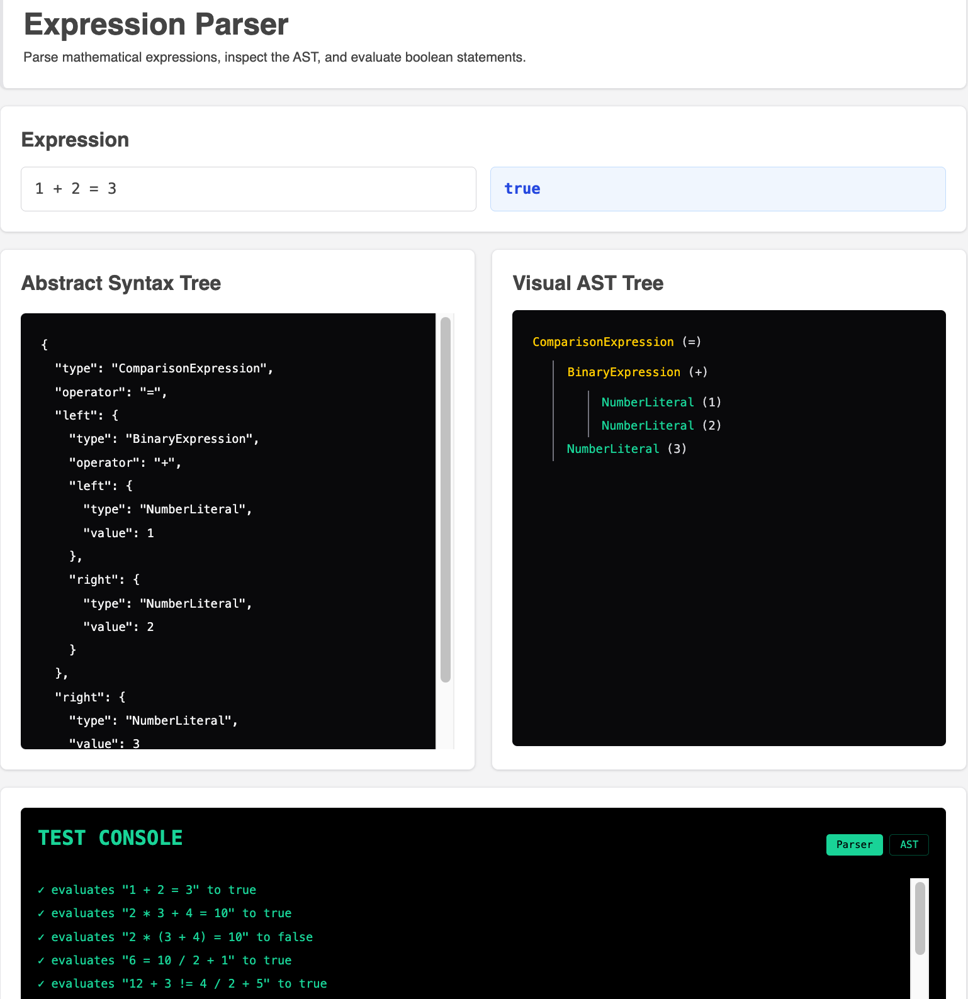
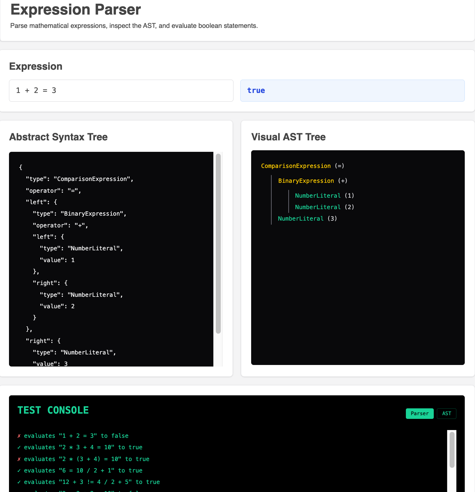

# Nearley Expression Parser

## Project Overview

This project is a mathematical expression parser built with Nearley and Moo.

## Features

- Built with Nearley and Moo
- Supports arithmetic and comparison expressions
- Operator precedence and parentheses support
- AST generation and visualization
- Real-time evaluation result
- Error location reporting
- Snapshot-based AST testing
- Shared test case architecture for parser/UI consistency

## Supported Operators

- Arithmetic: `+`, `-`, `*`, `/`, `**` |
- Comparison: `=`, `!=` |
- Unary: `+`, `-` |
- Grouping: `(` `)` |

## Bonus Features

- Exponentiation operator support (`**`)
- Right-associative exponentiation parsing
- Unary operator support (`+x`, `-x`)
- AST snapshot testing with Vitest
- Visual AST tree viewer
- Shared test case architecture across parser tests, AST snapshot tests, and UI validation console
- Reusable UI card/viewer component structure
- Real-time parser validation console
- Error handling with parser location reporting

## Tech Stack

- React
- TypeScript
- Vite
- Nearley
- Moo
- Vitest
- Tailwind CSS

## Installation

```bash
npm install
```

## Important Note About Vite + Nearley

Nearley generates the parser grammar as an IIFE-based CommonJS module.

Because the generated grammar is wrapped inside an IIFE, ES module imports cannot be used directly inside the generated output. As a result, the grammar relies on `require(...)` statements internally.

To make this work correctly within the Vite ESM environment, the project uses `vite-plugin-commonjs`

```js
// vite.config.ts
import commonjs from "vite-plugin-commonjs";

export default defineConfig({
  plugins: [commonjs(), ...],
   ...
});
```

This is required to correctly load the generated Nearley grammar inside the React application.

## Generate Parser Grammar

Whenever the grammar file (grammar.ne) changes, regenerate the parser:

```bash
npm run grammar
```

```json
// package.json
  "scripts": {
    "grammar": "nearleyc src/parser/grammar.ne -o src/parser/grammar.js",
  }
```

## Run Tests

```bash
npx vitest run src/parser/parser.test.ts
npx vitest run src/parser/ast.test.ts
```

## Update AST snapshots:

```bash
npx vitest -u
```

## Test Structure

There are two separate test files:

- parser.test.ts
  - Tests expression parsing and evaluation behavior
  - Covers arithmetic operations, comparison expressions, operator precedence, grouped expressions, invalid syntax handling, numeric edge cases, and bonus operators
- ast.test.ts
  - Tests AST generation behavior using snapshot testing
  - Verifies AST structure for valid expressions

## Test Console Validation

The demo UI includes a test console that uses the same shared test case data as the Vitest parser tests.

To verify that the console reflects **real parser behavior**, you can temporarily change an expected value in src/parser/testCases.ts

For example,

```js
{
  expression: "1 + 2 = 3",
  expected: false,    //  So you changed it from true to false
}
```

Then

```bash
npx vitest
```




The parser test should fail, and the UI validation console should also show a failed case.
**After testing, restore the expected value**

## Run Development Server

```bash
npm run dev
```


## Example Expressions

```txt
1 + 2 = 3
2 _ 3 + 4 = 10
2 _ (3 + 4) = 10
6 = 10 / 2 + 1
12 + 3 != 4 / 2 + 5
2 + 3 _ 2 = 10
2 _ 3 + 4 != 10
1 + (2 = 3
2 ** 3
2 * 3 ** 2
2 ** 3 ** 2
-5 + 2
+5 + 2
-(2 + 3)
5 ** -2
```

## Additional Edge Cases

```txt
10 / 2 / 5
10 / 0
0 / 0
```

The evaluator currently follows standard JavaScript numeric semantics:

```txt
10 / 0 -> Infinity
0 / 0 -> NaN
```

## Architecture Notes

The parser flow is separated into:

```txt
Input
→ Lexer (Moo)
→ Parser (Nearley)
→ AST Generation
→ AST Evaluation
```

The parser first generates an AST and then evaluates the expression through a separate evaluator layer.

Shared test cases are reused across:

- Parser tests
- AST snapshot tests
- UI validation console

## Summary

This project demonstrates a complete parser workflow using Nearley and Moo, including tokenization, recursive grammar parsing, AST generation, expression evaluation, and a React-based interactive demo UI.

## Future Improvements

With additional time, the project could be extended with:

- Better parser error formatting and recovery
- Additional numeric literal support (`Infinity`, `NaN`, decimals, scientific notation)
- Bitwise operator support (`&`, `|`, `^`, `<<`, `>>`)
- More advanced expression validation and semantic analysis
