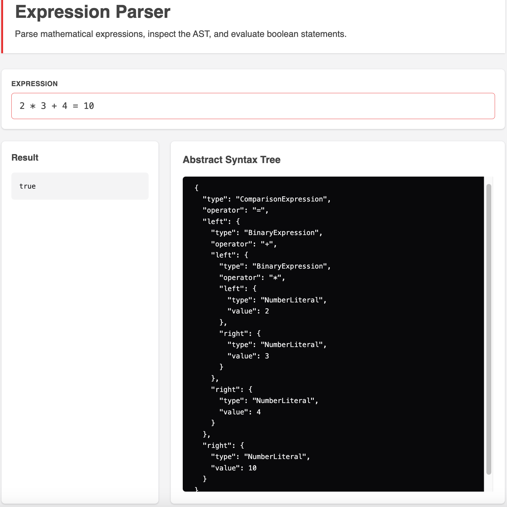
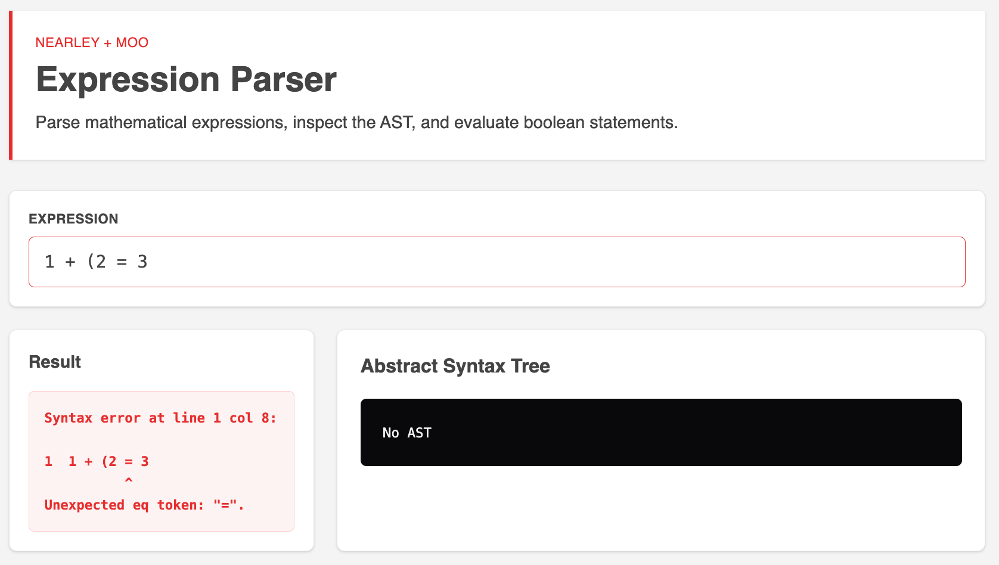

# Nearley Expression Parser

## Project Overview

This project is a mathematical expression parser built with Nearley and Moo.

The parser supports:

- Arithmetic expressions (`+`, `-`, `*`, `/`)
- Comparison expressions (`=`, `!=`)
- Operator precedence
- Parentheses grouping
- Abstract Syntax Tree (AST) generation
- Expression evaluation
- Invalid syntax detection with error location display

A React-based demo application is included to provide:

- Real-time expression parsing
- AST visualization
- Expression evaluation results
- Invalid syntax feedback

---

## Tech Stack

- React
- TypeScript
- Vite
- Nearley
- Moo
- Vitest
- Tailwind CSS

---

## Installation

Install dependencies:

```bash
npm install
```

## Important Note About Vite + Nearley

Nearley generates the parser grammar as an IIFE-based CommonJS module.

Because the generated grammar is wrapped inside an IIFE, ES module imports cannot be used directly inside the generated output. As a result, the grammar relies on `require(...)` statements internally.

To make this work correctly within the Vite ESM environment, the project uses:

```js
// vite.config.ts
import commonjs from "vite-plugin-commonjs";

export default defineConfig({
  plugins: [commonjs(), ...],
   ...
});
```

This is required to correctly load the generated Nearley grammar inside the React application.

## Generate Parser Grammar

Whenever the grammar file (grammar.ne) changes, regenerate the parser:

```bash
npm run grammar
```

```json
// package.json
  "scripts": {
    "grammar": "nearleyc src/parser/grammar.ne -o src/parser/grammar.js",
  }
```

## Test Structure

There are two separate test files in the project:

- `parser.test.ts`
  - Tests expression parsing and evaluation behavior

  - Covers arithmetic operations, comparison expressions, operator precedence, grouped expressions, invalid syntax handling, and numeric edge cases

- `ast.test.ts`
  - Tests AST generation behavior

  - Verifies that the parser produces the correct AST structure for literals, binary expressions, grouped expressions, and comparison expressions

```bash
npm vitest run src/parser/parser.test.ts
npm vitest run src/parser/ast.test.ts
```

## Run Development Server

````bash
npm run dev
```




## Example Expressions

````

1 + 2 = 3
2 _ 3 + 4 = 10
2 _ (3 + 4) = 10
6 = 10 / 2 + 1
12 + 3 != 4 / 2 + 5
2 + 3 _ 2 = 10
2 _ 3 + 4 != 10
1 + (2 = 3

```

## Additional Edge Cases

```

10 / 2 / 5
10 / 0
0 / 0

```

The evaluator currently follows standard JavaScript numeric semantics:

```

10 / 0 -> Infinity
0 / 0 -> NaN

```

## Architecture Notes

The parser flow is separated into:

```

Input
→ Lexer (Moo)
→ Parser (Nearley)
→ AST Generation
→ AST Evaluation

```

The parser first generates an AST and then evaluates the expression through a separate evaluator layer.

## Summary

This project demonstrates a complete parser workflow using Nearley and Moo, including tokenization, recursive grammar parsing, AST generation, expression evaluation, and a React-based interactive demo UI.

## Future Improvements

With additional time, the project could be extended with:

- Better parser error formatting and recovery
- Additional numeric literal support (`Infinity`, `NaN`, decimals, scientific notation)
- Bitwise operator support (`&`, `|`, `^`, `<<`, `>>`)
- More advanced expression validation and semantic analysis
```
